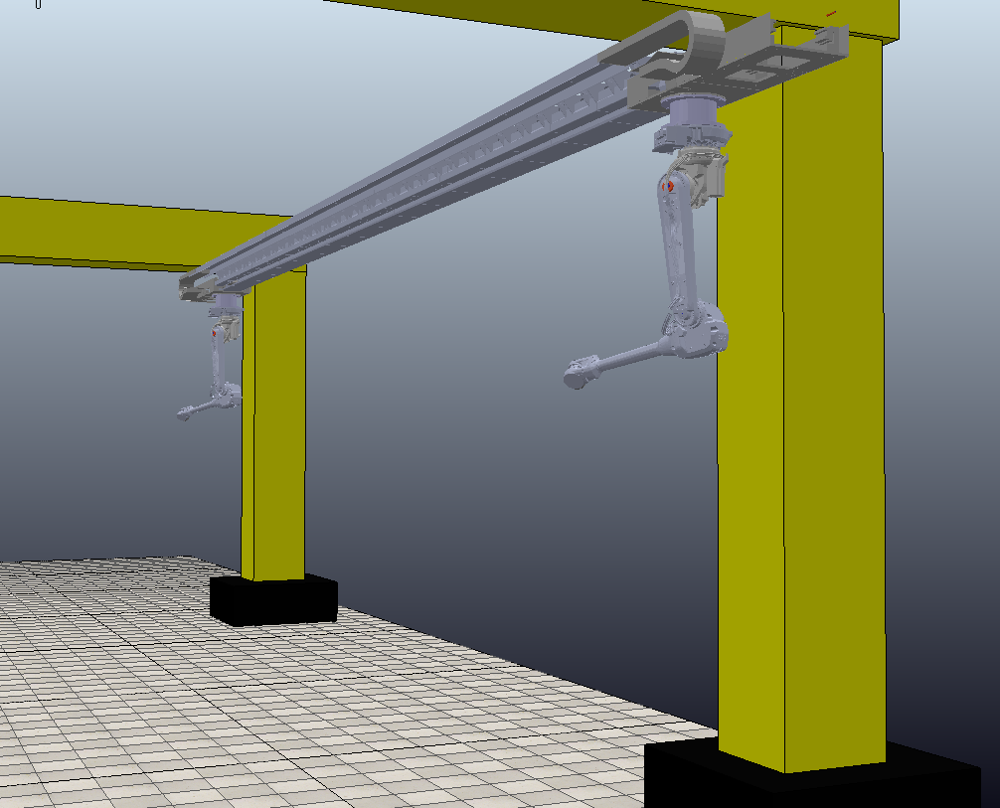

# MECA470_Project
### Robotic Collaboration for Timber Construction

-------------------------------------------------------------------------------------

Robotic Collaboration for Timber Construction

Project Members:
Joe Karam - 
Jerome Lee -
Haitham Mohamad -
Jesse Rath - 
Ian Yasui
      
 

-------------------------------------------------------------------------------------

  

   <h4> California State University Chico</h4>
   <h4> Department of Mechanical and Mechatronic Engineering and Advanced Manufacturing</h4> 
   <h4> MECA 470 - Introduction to Robotics</h4> 
   <h4> Robotic Collaboration for Timber Construction</h4> 
   <h4> Professor: Hasan Sinan Bank</h4> 

#### Table of Contents

- [1. Introduction](#1-Introduction)
- [2. Mobile Robot Degrees of Freedom (dof)](#2-Mobile-Robot-Degrees-of-Freedom)
- [3. Coppelia Simulation](#3-Coppelia-Simulation)
- [4. Connecting ROS to Coppelia](#4-Connecting-ROS-to-Coppelia) 
- [5. Appendix](#5-Appendix)
- [6. References](#6-References)

## 1. Introduction 

Despite the advancements in Timber prefabrication using CNC systems, the timber construction system still relies on manual labor in most of its tasks. This handicaps the sector when trying to take advantage of the rapidly spreading trend to use complex digital designs. This is where robotics plays a big role; Robotic systems lead to significant time savings, along with thei ability to transform the processes from manual to automated.
In this project, this group will work on a design to manufacture simulation in CoppeliaSim, along with architecting and designing the complete system and using the robot to assemble the predefined plan at minimum.

## 2. Mobile Robot Degrees of Freedom (dof)

The Magni mobile robot operates using a non-holonomic (meaning that its state depends on the path taken in order to achieve) differential drive system in the two front tires. As a differential drive mobile robot it has 3 degrees of freedom: X and Y directions (translational) and around the Z axis (rotational). 

When calculating the degrees of freedom for the mobile robot it was useful to reference Chapter 2 of our Modern Robotics textbook [1]. Chapter 2 Section 1 explains the procedure for finding the dof of a rigid body in 3 dimensional space based on its configuration. Specifically finding the dof of our mobile robot can be compared to the mathematical proof of finding the dof of a coin laying on a flat surface. For example the configuration of the coin can be described using two coordinates (x,y), additionally theta can be used to describe the orientation of the coin. Shown below is the mathematical proof for the 3 dof on the coin. 

  

                                                                                 
As previously states this proof also applies to the dof for the differential drive mobile robot as it has two translational degrees of freedom and one rotational degree of freedom. 

## 3. Mapping and Path Planning with ROS 

Someone needs to describe the use of ROS in the scope of this project 

 

  

    

<!--

// 

-->

  

This transfer function allows us to model the system in Simulink, and enables us to better visualize the system response.

  

  

<iframe src="https://drive.google.com/file/d/1dyAuiPnWZ_z191VjUVspRuHX62vPLFmA/view?usp=sharing" width="640" height="480"></iframe>

     

  

  

  --------------------------------------------------------------------------------------------------------------
  
  

  

## 4. Coppelia Simulation 

The Magni mobile robot was modeled using CoppeliaSim. An illustration of the simulation in addition to the Lua code are both provided below. 

       function sysCall_init()
            left_wheel=sim.getObjectHandle('Magni_LeftMotor')
            right_wheel=sim.getObjectHandle('Magni_RightMotor')
             xml = [[
                         <ui title="Speed Control" closeable="true" resizable="false" activate="false">
                         <group layout="form" flat="true">
                         <label text="Left Wheel (rad/s): 0.00" id="1"/>
                         <hslider tick-position="above" tick-interval="1" minimum="-10" maximum="10" on-change="actuateLeft" id="2"/>
                  <label text="Right Wheel (rad/s): 0.00" id="3"/>
        <hslider tick-position="above" tick-interval="1" minimum="-10" maximum="10" on-change="actuateRight" id="4"/>
    </group>
    <label text="" style="* {margin-left: 400px;}"/>
      </ui>
      ]]
        ui=simUI.create(xml)
    end
    
    function actuateLeft(ui,id,newVal)
            local val = 0.5*newVal
            sim.setJointTargetVelocity(left_wheel,val)
            simUI.setLabelText(ui,1,string.format("Left Wheel (rad/s): %.2f",val))
      end

     function actuateRight(ui,id,newVal)
            local val = 0.5*newVal
            sim.setJointTargetVelocity(right_wheel,val)
            simUI.setLabelText(ui,3,string.format("Right Wheel (rad/s): %.2f",val))
      end

## 5. Appendix

A1: Degree of Freedom Calculation: 
https://modernrobotics.northwestern.edu/nu-gm-book-resource/2-2-degrees-of-freedom-of-a-robot/

A2: Magni Mobile Robot Information: 
https://www.roboticsbusinessreview.com/robotic-company/directory/listings/ubiquity-robotics/

## 6. References

[1] Lynch, K., &amp; Park, F. C. (2019). Modern robotics: Mechanics, planning, and control. Cambridge, United Kingdom: Cambridge University Press.

<a href="https://github.com/janso2000/MECHA470_Mobile_Sanitation_Robot"> Click here to go to our project repository </a>
