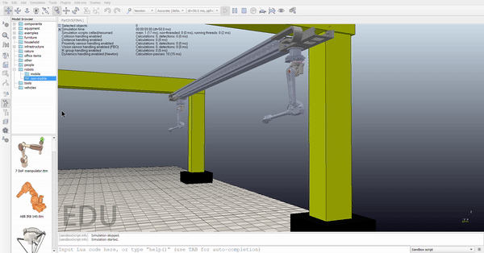
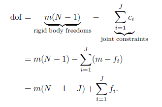
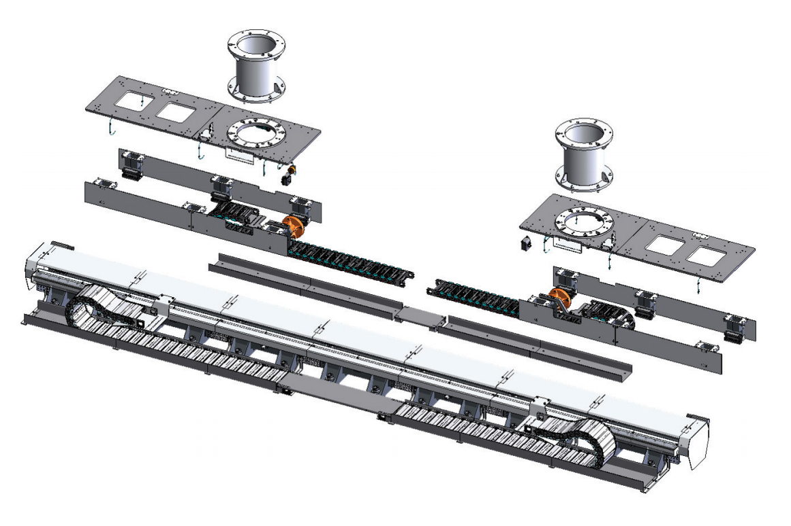
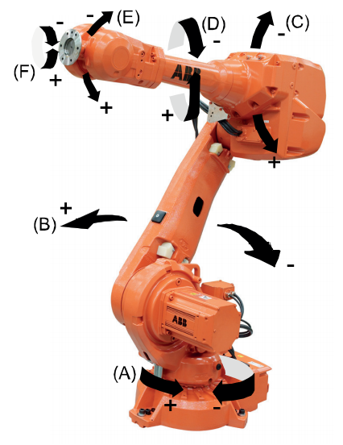

# MECA470_Project
### Robotic Collaboration for Timber Construction

-------------------------------------------------------------------------------------

Robotic Collaboration for Timber Construction

Project Members:
Joe Karam - 
Jerome Lee -
Haitham Mohamad -
Jesse Rath - 
Ian Yasui
      
 

-------------------------------------------------------------------------------------

  

   <h4> <a href="https://www.csuchico.edu/" target="_blank">California State University Chico</a></h4>
   <h4> <a href="https://www.csuchico.edu/mmem/" target="_blank">Department of Mechanical and Mechatronic Engineering and Advanced Manufacturing</a></h4> 
   <h4> <a href="./Media/Syllabus.pdf" target="_blank">MECA 470 - Introduction to Robotics</a></h4> 
   <h4> Robotic Collaboration for Timber Construction</h4> 
   <h4> Professor: Hasan Sinan Bank</h4> 

#### Table of Contents

- [1. Introduction](#1-Introduction)
- [2. Mobile Robot Degrees of Freedom](#2-Mobile-Robot-Degrees-of-Freedom)
- [3. Coppelia Simulation](#3-Coppelia-Simulation)
- [4. Connecting ROS to Coppelia](#4-Connecting-ROS-to-Coppelia) 
- [5. Appendix](#5-Appendix)
- [6. References](#6-References)

## 1. Introduction 

Despite the advancements in Timber prefabrication using CNC systems, the timber construction system still relies on manual labor in most of its tasks. This handicaps the sector when trying to take advantage of the rapidly spreading trend to use complex digital designs. This is where robotics plays a big role; Robotic systems lead to significant time savings, along with their ability to transform the processes from manual to automated. 
In this project, this group will work on a design to manufacture simulation in CoppeliaSim, along with architecting and designing the complete system and using the robot to assemble the predefined plan at minimum.

## 2. Mobile Robot Degrees of Freedom

The system is composed of three essential component:

-The Gantry Crane which has the <b>"ABB IRBT 2005"</b> as its main constituent.  
   -Two Articulated Robots <b>"ABB IRB 4600"</b>; These two robots are carried by the Gantry crane.   

      
 The goal of this section is calculating the Degrees of Freedom of the whole system before performing the Coppelia Simulation. In order to do so, the book "Modern Robotics"[1] was used, specifically Section 2.2 of Chapter 2 explain the Degrees of Freedom (DoF) of a Robot using the formula below:
 
 

  

                                                                                       
Where <i>m</i> is the number of DoF of a body (6 for spatial and 3 for planar), <i>N</i> is the number of Links (including ground frame as a link), <i>J</i> is the number of Joints, and <i>fi</i> is the number of DoF of the ith joint (this will be the sum of all <i>fi</i>s of the considered system).   

For the first system, which includes the <b>"ABB IRBT 2005"</b>, the DoF are calculated:

 

  

The values for the above formula are as follows:

-<i>m</i> = 6 , since we are considering this study to be spatial (3D)  
   -<i>N</i> = 6  
   -<i>J</i> = 5  
   -<i>fi</i> has 1 for each individual value since all the joints are prismatic joints (sum = 5)  
 We can conclude that the gantry crane that carries the two articulated robots has 5 Degrees of Freedom.  

 
 For the second system, which includes the <b>"ABB IRB 4600"</b>, the DoF are calculated:

 

  

The values for the above formula are as follows:

-<i>m</i> = 6 , since we are considering this study to be spatial (3D)  
   -<i>N</i> = 7  
   -<i>J</i> = 6  
   -<i>fi</i> has 1 for each individual value since all the joints are either prismatic or revolute joints (sum = 6)  
 We can conclude that the articulated robots have 6 Degrees of Freedom each, for a total of 12 for both.  

       
 After doing all the necessary claculations, the results show thta the whole system has <b>17 DoF</b>.

## 3. Coppelia Simulation

CoppeliaSim is the program used for the Robotic Simulation of this Project. It runs faster and has more features than V-REP (which is what it is formerly known as).  
To implement this system in Coppelia, CAD files were downloaded from the ABB website [2][3], and were transferred to a .ttt file using a Solidworks to URDF exporter toolbox. Afterwards, the system was generated as seen in the snip below:

  

                                                                                           
After the system being initiated, a controller has been created for this system, including 17 knobs, each for a specific Degree of Freedom (GIF at the beginning of this README file). To do so, a code has been written in Coppelia. Since this code is long because of the system's DoFs, it is not going to be printed below (it is located in <a href="./CoppeliaCodes/Controller" target="_blank">Controller</a>). In addition, the file that has the whole Coppelia System is located in <a href="./CoppeliaCodes/Timber_Controller.ttt" target="_blank">Timber Controller</a>.  

Another way to control our Robot in Coppelia was learned using Visual Studio Code. A code was implemented in VS Code and a connection between VSC and Coppelia has been established in order to control this process. The outcome is very helpful, since there are two ways to control the system now. The code is is located in <a href="./CoppeliaCodes/VSCode_Controller.py" target="_blank">VSCode Controller</a> and will be printed below: 

                                         

Someone needs to describe the use of ROS in the scope of this project 

 

  

    

<!--

// 

-->

  

This transfer function allows us to model the system in Simulink, and enables us to better visualize the system response.

  

  

<iframe src="https://drive.google.com/file/d/1dyAuiPnWZ_z191VjUVspRuHX62vPLFmA/view?usp=sharing" width="640" height="480"></iframe>

     

  

  

  --------------------------------------------------------------------------------------------------------------
  
  

  

## 4. Connecting ROS to Coppelia

The Magni mobile robot was modeled using CoppeliaSim. An illustration of the simulation in addition to the Lua code are both provided below. 

       function sysCall_init()
            left_wheel=sim.getObjectHandle('Magni_LeftMotor')
            right_wheel=sim.getObjectHandle('Magni_RightMotor')
             xml = [[
                         <ui title="Speed Control" closeable="true" resizable="false" activate="false">
                         <group layout="form" flat="true">
                         <label text="Left Wheel (rad/s): 0.00" id="1"/>
                         <hslider tick-position="above" tick-interval="1" minimum="-10" maximum="10" on-change="actuateLeft" id="2"/>
                  <label text="Right Wheel (rad/s): 0.00" id="3"/>
        <hslider tick-position="above" tick-interval="1" minimum="-10" maximum="10" on-change="actuateRight" id="4"/>
    </group>
    <label text="" style="* {margin-left: 400px;}"/>
      </ui>
      ]]
        ui=simUI.create(xml)
    end
    
    function actuateLeft(ui,id,newVal)
            local val = 0.5*newVal
            sim.setJointTargetVelocity(left_wheel,val)
            simUI.setLabelText(ui,1,string.format("Left Wheel (rad/s): %.2f",val))
      end

     function actuateRight(ui,id,newVal)
            local val = 0.5*newVal
            sim.setJointTargetVelocity(right_wheel,val)
            simUI.setLabelText(ui,3,string.format("Right Wheel (rad/s): %.2f",val))
      end

## 5. Appendix

A1: Degree of Freedom Calculation: 
https://modernrobotics.northwestern.edu/nu-gm-book-resource/2-2-degrees-of-freedom-of-a-robot/

A2: Magni Mobile Robot Information: 
https://www.roboticsbusinessreview.com/robotic-company/directory/listings/ubiquity-robotics/

## 6. References

[1] Lynch, K., &amp; Park, F. C. (2019). Modern robotics: Mechanics, planning, and control. Cambridge, United Kingdom: Cambridge University Press.

<a href="https://github.com/janso2000/MECHA470_Mobile_Sanitation_Robot"> Click here to go to our project repository </a>
